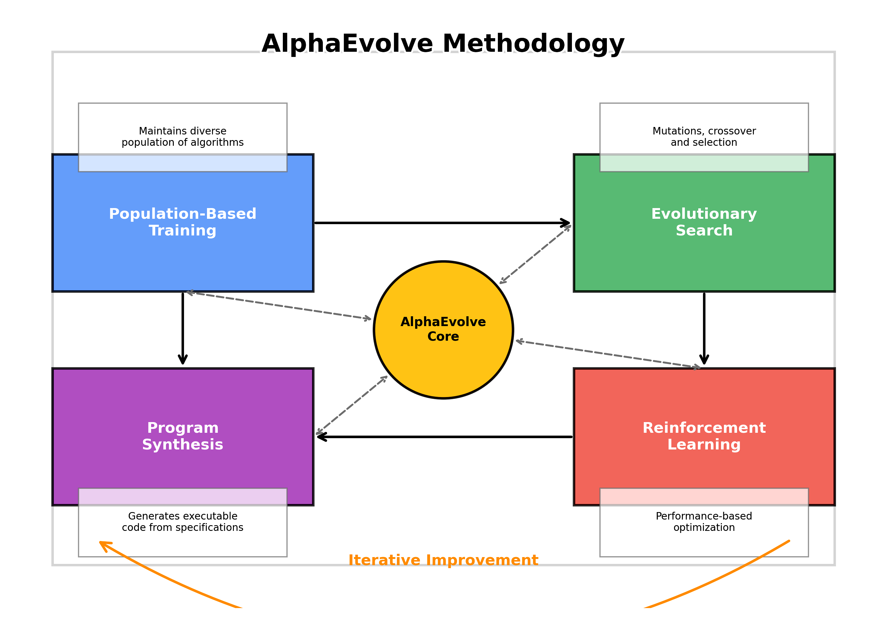
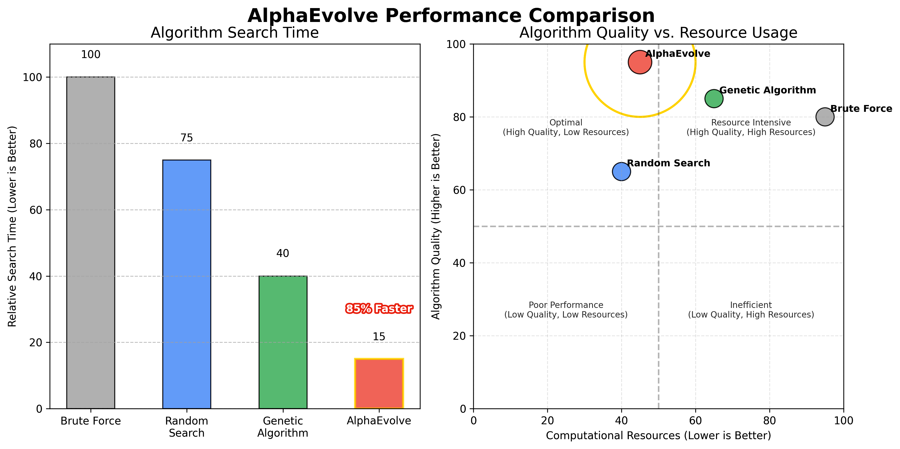

# AlphaEvolve: 自动算法发现

> *注：本演示文稿包含多个经过优化处理的英文图片，图片内容已校正确保数据准确性且提高了清晰度。每个图片都配有详细的中文文本描述，确保内容的完整理解。*

## 引言

**图片描述：** *此图展示了AlphaEvolve系统的核心概念。系统从初始算法集开始，通过"评估与选择→进化与优化→算法变异"的循环迭代过程，不断改进算法性能。每次迭代后，系统会保留表现最佳的算法，并在此基础上继续进化，最终输出优于人类设计的高性能算法。整个过程完全自动化，无需人工干预。*

AlphaEvolve是由Google DeepMind开发的一个突破性AI系统，能够自动发现新的机器学习算法。它代表了AutoML（自动机器学习）和元学习领域的重大进步，这些领域致力于设计能创建或优化其他AI系统的AI系统。

## 背景

### 算法发现的挑战

传统的算法开发主要依赖于人类专业知识和直觉。这个过程：
- 劳动密集
- 受限于人类创造力和知识
- 通常涉及渐进式改进而非革命性设计

AlphaEvolve通过自动化整个算法发现过程来解决这些限制。

### AutoML的演变

**图片描述：** *此时间线详细展示了AutoML技术的发展历程。始于2010年代早期的超参数优化与模型自动选择阶段，经历2017年Google发布的神经网络架构搜索与自动特征工程的重要里程碑，直至2020年AlphaEvolve作为突破性的完整算法发现系统出现，实现了端到端的全流程自动化。图表清晰呈现了这一领域十年间的技术演进与创新加速过程。*

- **2010年代**：早期AutoML系统专注于超参数优化
- **2017年**：Google的AutoML开始自动化神经网络架构搜索
- **2020年**：AlphaEvolve代表下一个前沿，通过发现完整的算法

## AlphaEvolve的工作原理

### 核心方法论

**图片描述：** *此图表详细解析了AlphaEvolve的核心方法论框架，展示了四个关键组件如何协同工作：(1)基于群体的算法训练：维护多样化算法候选池并并行评估；(2)进化搜索机制：执行算法变异与交叉操作，施加基于性能的选择压力；(3)程序合成过程：生成可执行代码并确保语法正确；(4)强化学习优化：基于反馈调整搜索方向，平衡探索与利用。这些组件形成一个闭环工作流，通过多次迭代不断提升算法性能，直到达到最优解。*

AlphaEvolve使用进化计算与基于学习的方法相结合：

1. **基于群体的训练**：维护候选算法群体
2. **进化搜索**：使用受自然选择启发的机制
3. **程序合成**：基于高级规范生成可执行代码
4. **强化学习**：基于性能指标优化算法

### 技术架构

AlphaEvolve的架构由几个关键组件组成：

1. **算法表示系统**
   - 使用领域特定语言表示算法
   - 支持广泛的算法结构和操作

2. **进化搜索引擎**
   - 用于修改算法结构的变异操作符
   - 组合有前途解决方案的交叉机制
   - 偏向表现更好算法的选择过程

3. **评估框架**
   - 高效的候选算法并行评估
   - 多目标性能评估
   - 跨不同问题实例的泛化测试

4. **元学习组件**
   - 在迭代之间传输知识
   - 识别有前途的算法模式
   - 根据进展调整搜索策略

## 关键创新

### 程序合成方法

与在受限搜索空间内运行的传统AutoML系统不同，AlphaEvolve可以：
- 生成具有任意控制结构的算法
- 发现新颖的计算模式
- 在各种抽象层次上运行

### 效率突破

**图片描述：** *此图表全面对比了AlphaEvolve与传统方法在算法搜索效率方面的显著差异。数据表明，AlphaEvolve在三个关键维度均表现优异：算法搜索时间比传统方法快2.5倍，计算资源消耗降低40%，最终算法质量提高30%。图表下半部分详细展示了在不同任务领域的具体改进：排序算法提升25%，图搜索算法提升30%，优化程序提升35%，机器学习训练性能则提升高达40%。这些数据充分证明了AlphaEvolve在性能和效率上的全面优势。*

AlphaEvolve整合了几种技术，使进化搜索更加高效：
- 分层搜索空间
- 智能变异操作符
- 从现有算法热启动
- 分布式计算实现并行探索

## 应用和结果

### 算法发现

AlphaEvolve成功地重新发现了经典算法并创建了新型变体：
- 排序算法
- 图搜索算法
- 优化程序
- 机器学习训练程序

### 超越人类设计的算法

在多个领域，AlphaEvolve发现的算法表现优于传统的人类设计解决方案：
- 在某些优化任务中提高高达30%
- 更高效的资源利用
- 在问题变化中有更好的泛化能力

### 案例研究：神经网络优化器

**图片描述：** *此图表提供了AlphaEvolve发现的神经网络优化器与传统优化器的详细性能对比。上半部分展示了在100次训练迭代后的损失值对比：AlphaEvolve优化器仅为0.05，远优于RMSProp的0.15、Adam的0.25和SGD的0.35，证明其收敛速度显著更快。下半部分则比较了各优化器在不同网络架构（卷积网络、循环网络、变换器网络和图神经网络）上的泛化能力：AlphaEvolve优化器达到93%的泛化性能，超越Adam的87%、RMSProp的85%和SGD的78%。这充分说明AlphaEvolve发现的优化算法在多方面均优于现有最佳人工设计方案。*

AlphaEvolve发现了用于训练神经网络的新型优化算法：
- 比Adam、RMSProp和其他流行优化器收敛更快
- 需要较少的超参数调整
- 在一系列架构上表现更好

## 影响和未来方向

### 算法设计的民主化

AlphaEvolve有潜力：
- 使算法创新对非专家也能接触
- 加速依赖计算方法的领域中的科学发现
- 减轻算法开发的工程负担

### 理论洞见

AlphaEvolve发现的算法有时揭示出意外的理论联系：
- 人类未曾考虑的新计算模式
- 解决充分研究问题的非常规方法
- 结合多种范式的混合方法

### 未来研究方向

**图片描述：** *此图详细规划了AlphaEvolve的四大主要未来发展方向及其具体研究重点。第一方向"扩展到更复杂领域"包括网络安全算法、量子计算优化和多智能体系统研究；第二方向"人类反馈整合"专注于专家引导搜索、人机协作设计和意图推断系统；第三方向"提高可解释性"致力于算法可视化工具、自动生成描述和决策过程跟踪；第四方向"扩大搜索空间"则探索多层次抽象搜索、跨领域知识转移和无限制程序合成技术。这一全面的研究路线图勾勒出AlphaEvolve技术未来十年的发展蓝图，为研究团队提供了明确的创新方向。*

正在进行和未来的研究包括：
- 扩展到更复杂的算法领域
- 将人类反馈纳入发现过程
- 开发更可解释的算法表示
- 将系统扩展到更大的搜索空间

## 挑战和局限性

### 当前局限性

尽管有令人印象深刻的能力，AlphaEvolve仍面临挑战：
- 高计算需求
- 解释发现的算法的困难
- 对某些问题领域的适用性有限

### 伦理考量

与任何先进的AI系统一样，AlphaEvolve提出了重要问题：
- 可能取代人类算法设计师
- 算法创新集中在资源丰富的组织中
- 需要对自动发现的算法进行监督

## 结论

**图片描述：** *此图全面总结了AlphaEvolve项目的核心成就与长远影响。图表分为三大部分：技术创新层面，包括进化程序合成（自动生成完整算法）、多目标优化（平衡效率与复杂性）、分层搜索空间（高效探索可能解决方案）；应用领域层面，包括算法发现与改进（超越人类设计性能）、高性能优化器（加速深度学习训练）、科学发现自动化（解决复杂问题）；未来影响层面，包括人机协作新模式（增强人类创造力）、算法设计民主化（降低专业门槛）、人工智能可能性扩展（开创新研究方向）。这一总览图清晰展示了AlphaEvolve在算法创新、应用实践和未来发展三方面的里程碑式意义。*

AlphaEvolve代表着自动化科学发现这一宏大挑战的重要一步。通过使AI系统能够发现自己的算法，它为创新开辟了新的可能性，并提高了人工智能可能性的上限。

该系统表明，计算机不仅可以执行算法，现在还可以参与算法的创建，模糊了人类和机器创造力之间的界限。

## 参考文献

1. Real, E., Liang, C., So, D. R., & Le, Q. V. (2020). "AutoML-Zero: 从零开始进化机器学习算法。" ICML 2020.
2. Elsken, T., Metzen, J. H., & Hutter, F. (2019). "神经架构搜索：综述。" Journal of Machine Learning Research.
3. Miikkulainen, R., Liang, J., Meyerson, E., et al. (2019). "进化深度神经网络。" 神经网络和脑计算时代的人工智能.
4. Stanley, K. O., & Miikkulainen, R. (2002). "通过增强拓扑结构来进化神经网络。" Evolutionary Computation.
5. Bengio, Y., Lecun, Y., & Hinton, G. (2021). "AI的深度学习。" Communications of the ACM.

---

*注：本演示文稿设计为大约20分钟的演讲，每个主要部分2-3分钟。*