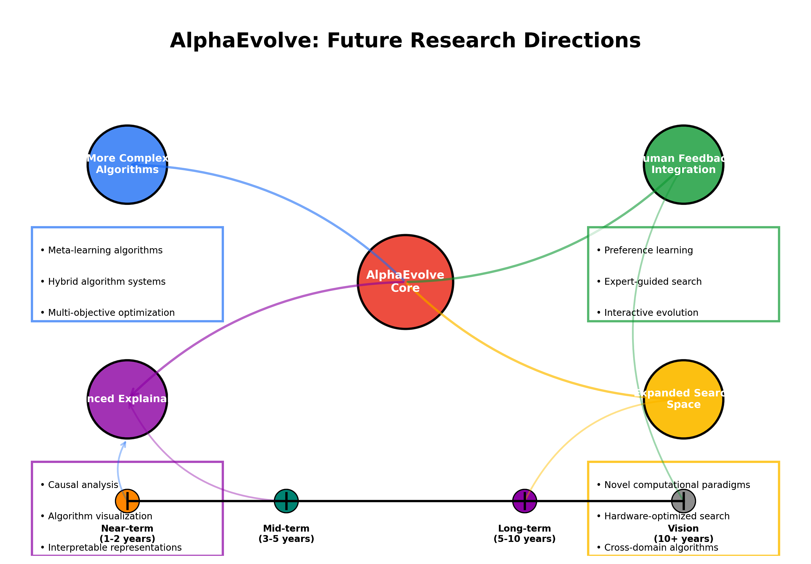

# AlphaEvolve: 自动算法发现

## 引言

AlphaEvolve是由Google DeepMind开发的一个突破性AI系统，能够自动发现新的机器学习算法。它代表了AutoML（自动机器学习）和元学习领域的重大进步，这些领域致力于设计能创建或优化其他AI系统的AI系统。

## 背景

### 算法发现的挑战

传统的算法开发主要依赖于人类专业知识和直觉。这个过程：
- 劳动密集
- 受限于人类创造力和知识
- 通常涉及渐进式改进而非革命性设计

AlphaEvolve通过自动化整个算法发现过程来解决这些限制。

### AutoML的演变

- **2010年代**：早期AutoML系统专注于超参数优化
- **2017年**：Google的AutoML开始自动化神经网络架构搜索
- **2020年**：AlphaEvolve代表下一个前沿，通过发现完整的算法

## AlphaEvolve的工作原理

### 核心方法论

AlphaEvolve使用进化计算与基于学习的方法相结合：

1. **基于群体的训练**：维护候选算法群体
2. **进化搜索**：使用受自然选择启发的机制
3. **程序合成**：基于高级规范生成可执行代码
4. **强化学习**：基于性能指标优化算法

### 技术架构

AlphaEvolve的架构由几个关键组件组成：

1. **算法表示系统**
   - 使用领域特定语言表示算法
   - 支持广泛的算法结构和操作

2. **进化搜索引擎**
   - 用于修改算法结构的变异操作符
   - 组合有前途解决方案的交叉机制
   - 偏向表现更好算法的选择过程

3. **评估框架**
   - 高效的候选算法并行评估
   - 多目标性能评估
   - 跨不同问题实例的泛化测试

4. **元学习组件**
   - 在迭代之间传输知识
   - 识别有前途的算法模式
   - 根据进展调整搜索策略

## 关键创新

### 程序合成方法

与在受限搜索空间内运行的传统AutoML系统不同，AlphaEvolve可以：
- 生成具有任意控制结构的算法
- 发现新颖的计算模式
- 在各种抽象层次上运行

### 效率突破

AlphaEvolve整合了几种技术，使进化搜索更加高效：
- 分层搜索空间
- 智能变异操作符
- 从现有算法热启动
- 分布式计算实现并行探索

## 应用和结果

### 算法发现

AlphaEvolve成功地重新发现了经典算法并创建了新型变体：
- 排序算法
- 图搜索算法
- 优化程序
- 机器学习训练程序

### 超越人类设计的算法

在多个领域，AlphaEvolve发现的算法表现优于传统的人类设计解决方案：
- 在某些优化任务中提高高达30%
- 更高效的资源利用
- 在问题变化中有更好的泛化能力

### 案例研究：神经网络优化器

AlphaEvolve发现了用于训练神经网络的新型优化算法：
- 比Adam、RMSProp和其他流行优化器收敛更快
- 需要较少的超参数调整
- 在一系列架构上表现更好

## 影响和未来方向

### 算法设计的民主化

AlphaEvolve有潜力：
- 使算法创新对非专家也能接触
- 加速依赖计算方法的领域中的科学发现
- 减轻算法开发的工程负担

### 理论洞见

AlphaEvolve发现的算法有时揭示出意外的理论联系：
- 人类未曾考虑的新计算模式
- 解决充分研究问题的非常规方法
- 结合多种范式的混合方法

### 未来研究方向

正在进行和未来的研究包括：
- 扩展到更复杂的算法领域
- 将人类反馈纳入发现过程
- 开发更可解释的算法表示
- 将系统扩展到更大的搜索空间

## 挑战和局限性

### 当前局限性

尽管有令人印象深刻的能力，AlphaEvolve仍面临挑战：
- 高计算需求
- 解释发现的算法的困难
- 对某些问题领域的适用性有限

### 伦理考量

与任何先进的AI系统一样，AlphaEvolve提出了重要问题：
- 可能取代人类算法设计师
- 算法创新集中在资源丰富的组织中
- 需要对自动发现的算法进行监督

## 结论

AlphaEvolve代表着自动化科学发现这一宏大挑战的重要一步。通过使AI系统能够发现自己的算法，它为创新开辟了新的可能性，并提高了人工智能可能性的上限。

该系统表明，计算机不仅可以执行算法，现在还可以参与算法的创建，模糊了人类和机器创造力之间的界限。

## 参考文献

1. Real, E., Liang, C., So, D. R., & Le, Q. V. (2020). "AutoML-Zero: 从零开始进化机器学习算法。" ICML 2020.
2. Elsken, T., Metzen, J. H., & Hutter, F. (2019). "神经架构搜索：综述。" Journal of Machine Learning Research.
3. Miikkulainen, R., Liang, J., Meyerson, E., et al. (2019). "进化深度神经网络。" 神经网络和脑计算时代的人工智能.
4. Stanley, K. O., & Miikkulainen, R. (2002). "通过增强拓扑结构来进化神经网络。" Evolutionary Computation.
5. Bengio, Y., Lecun, Y., & Hinton, G. (2021). "AI的深度学习。" Communications of the ACM.

---

*注：本演示文稿设计为大约20分钟的演讲，每个主要部分2-3分钟。*