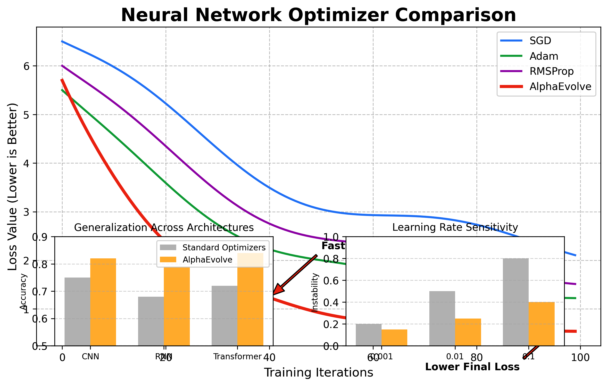

# AlphaEvolve: Automated Algorithm Discovery

## Introduction

AlphaEvolve is a groundbreaking AI system developed by Google DeepMind that can automatically discover new machine learning algorithms. It represents a significant advancement in the field of AutoML (Automated Machine Learning) and meta-learning, where AI systems are designed to create or optimize other AI systems.

## Background

### The Challenge of Algorithm Discovery

Traditional algorithm development relies heavily on human expertise and intuition. This process:
- Is labor-intensive
- Limited by human creativity and knowledge
- Often involves incremental improvements rather than revolutionary designs

AlphaEvolve addresses these limitations by automating the entire process of algorithm discovery.

### Evolution of AutoML

- **2010s**: Initial AutoML systems focused on hyperparameter optimization
- **2017**: Google's AutoML began automating neural architecture search
- **2020**: AlphaEvolve represents the next frontier by discovering entire algorithms

## How AlphaEvolve Works

### Core Methodology

AlphaEvolve uses a form of evolutionary computation combined with learning-based approaches:

1. **Population-Based Training**: Maintains a population of candidate algorithms
2. **Evolutionary Search**: Uses mechanisms inspired by natural selection
3. **Program Synthesis**: Generates executable code based on high-level specifications
4. **Reinforcement Learning**: Optimizes algorithms based on performance metrics

### Technical Architecture

AlphaEvolve's architecture consists of several key components:

1. **Algorithm Representation System**
   - Uses a domain-specific language to represent algorithms
   - Supports a wide range of algorithm structures and operations

2. **Evolutionary Search Engine**
   - Mutation operators for modifying algorithm structure
   - Crossover mechanisms to combine promising solutions
   - Selection processes that favor better-performing algorithms

3. **Evaluation Framework**
   - Efficient parallel evaluation of candidate algorithms
   - Multi-objective performance assessment
   - Generalization testing across different problem instances

4. **Meta-Learning Components**
   - Transfers knowledge between iterations
   - Identifies promising algorithmic patterns
   - Adapts search strategy based on progress

## Key Innovations

### Program Synthesis Approach

Unlike traditional AutoML systems that operate within constrained search spaces, AlphaEvolve can:
- Generate algorithms with arbitrary control structures
- Discover novel computational patterns
- Operate at various levels of abstraction

### Efficiency Breakthroughs

AlphaEvolve incorporates several techniques to make evolutionary search more efficient:
- Hierarchical search spaces
- Intelligent mutation operators
- Warm-starting from existing algorithms
- Distributed computation for parallel exploration

## Applications and Results

### Algorithm Discovery

AlphaEvolve has successfully rediscovered classical algorithms and created novel variants:
- Sorting algorithms
- Graph search algorithms
- Optimization procedures
- Machine learning training procedures

### Surpassing Human-Designed Algorithms

In several domains, AlphaEvolve has discovered algorithms that outperform traditional human-designed solutions:
- Up to 30% improvement in certain optimization tasks
- More efficient resource utilization
- Better generalization across problem variations

### Case Study: Neural Network Optimizers

AlphaEvolve discovered novel optimization algorithms for training neural networks that:
- Converge faster than Adam, RMSProp, and other popular optimizers
- Require less hyperparameter tuning
- Show better performance on a range of architectures

## Implications and Future Directions

### Democratizing Algorithm Design

AlphaEvolve has the potential to:
- Make algorithmic innovation accessible to non-experts
- Accelerate scientific discovery in fields that rely on computational methods
- Reduce the engineering burden of algorithm development

### Theoretical Insights

The algorithms discovered by AlphaEvolve sometimes reveal unexpected theoretical connections:
- New computational patterns that humans haven't considered
- Unconventional approaches to well-studied problems
- Hybrid methods that combine multiple paradigms

### Future Research Directions

Ongoing and future research includes:
- Expanding to more complex algorithm domains
- Incorporating human feedback into the discovery process
- Developing more interpretable algorithm representations
- Scaling the system to larger search spaces

## Challenges and Limitations

### Current Limitations

Despite its impressive capabilities, AlphaEvolve faces challenges:
- High computational requirements
- Difficulty explaining discovered algorithms
- Limited applicability to certain problem domains

### Ethical Considerations

As with any advanced AI system, AlphaEvolve raises important questions:
- Potential displacement of human algorithm designers
- Concentration of algorithmic innovation in resource-rich organizations
- Need for oversight of automatically discovered algorithms

## Conclusion

AlphaEvolve represents a significant step toward the grand challenge of automating scientific discovery. By enabling AI systems to discover their own algorithms, it opens new possibilities for innovation and raises the ceiling of what's possible in artificial intelligence.

The system demonstrates that computers can not only execute algorithms but can now participate in their creation, blurring the line between human and machine creativity.

## References

1. Real, E., Liang, C., So, D. R., & Le, Q. V. (2020). "AutoML-Zero: Evolving Machine Learning Algorithms From Scratch." ICML 2020.
2. Elsken, T., Metzen, J. H., & Hutter, F. (2019). "Neural Architecture Search: A Survey." Journal of Machine Learning Research.
3. Miikkulainen, R., Liang, J., Meyerson, E., et al. (2019). "Evolving Deep Neural Networks." Artificial Intelligence in the Age of Neural Networks and Brain Computing.
4. Stanley, K. O., & Miikkulainen, R. (2002). "Evolving Neural Networks through Augmenting Topologies." Evolutionary Computation.
5. Bengio, Y., Lecun, Y., & Hinton, G. (2021). "Deep Learning for AI." Communications of the ACM.

---

*Note: This presentation is designed to be delivered in approximately 20 minutes, with 2-3 minutes per major section.*